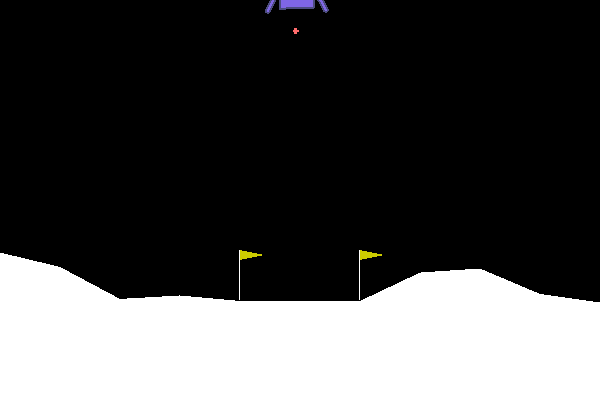

# Repository for Semester Project 2
To install the project as an editable package, please use at the root directory:
```bash
pip install -e .
```
### Preliminary experiments:
- **DDQN**
  - CartPole-v0 (Before & After Training):
    
    
    
    
  - LunarLander-v3 (Before & After Training):
    
    
    

### Random Sampling Policy:


