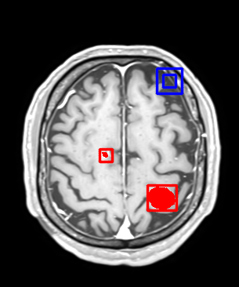
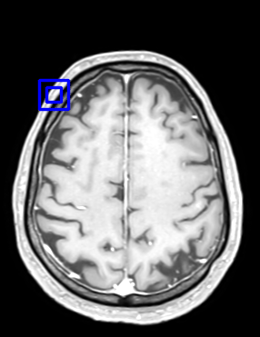

# Repository for Semester Project 2
To install the project as an editable package, please use at the root directory:
```bash
pip install -e .
```
### Preliminary experiments:
- **DDQN**
  - CartPole-v0 (Before & After Training):
    <table>
      <tr>
         <td></td>
         <td></td>
      </tr>
    </table>
    
    
  - LunarLander-v3 (Before & After Training):
    <table>
      <tr>
         <td></td>
         <td></td>
      </tr>
    </table>

### Random Sampling Policy:
<table>
  <tr>
    <td></td>
    <td></td>
  </tr>
 </table>

### Greedy Policy
Without Inhibition of Return (IoR); with IoR, episodes 25 & 30
<table>
  <tr>
    <td></td>
    <td></td>
    <td></td>
   <tr>
</table>


### Grid of Agents in a Testing Volume
<table>

[comment]: <> (  <tr>)

[comment]: <> (    <td></td>)

[comment]: <> (    <td></td>)

[comment]: <> (    <td></td>)

[comment]: <> (    <td></td>)

[comment]: <> (  <tr>)
  
[comment]: <> (  <tr>)

[comment]: <> (    <td></td>)

[comment]: <> (    <td></td>)

[comment]: <> (    <td></td>)

[comment]: <> (    <td></td>)

[comment]: <> (  <tr>)


   <tr> 
        <td></td>
        <td></td>
    </tr>
</table>
